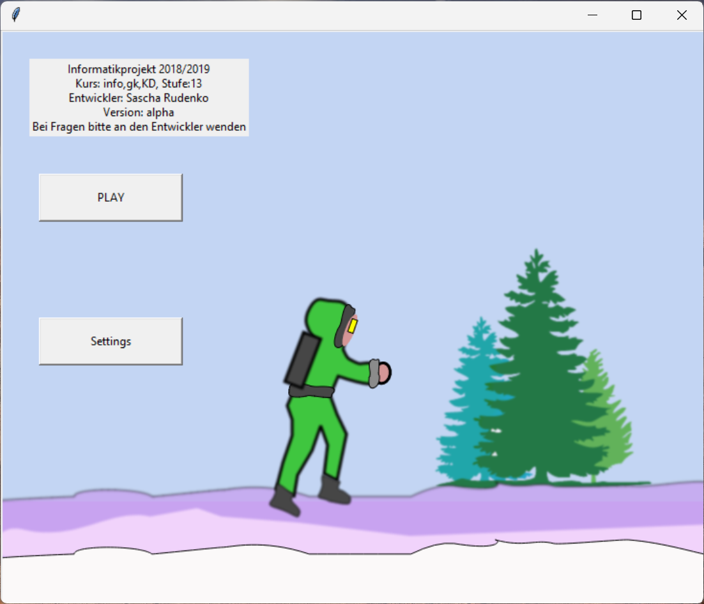
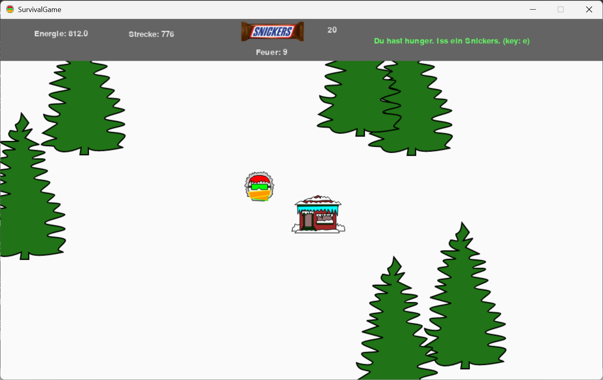
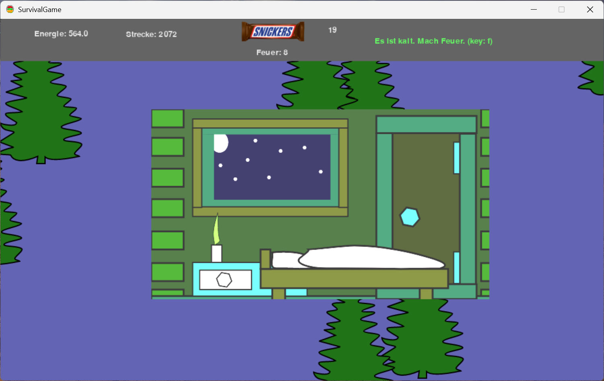

# wintersurvival
A game developed as a project in my computer science class in high school

# Screenshots
<p float="left">
  
  
  
  
</p>

## Requirements
- Python 3.X
- Pygame 

## Starting the game
run 
```python startgame.py``` in the terminal